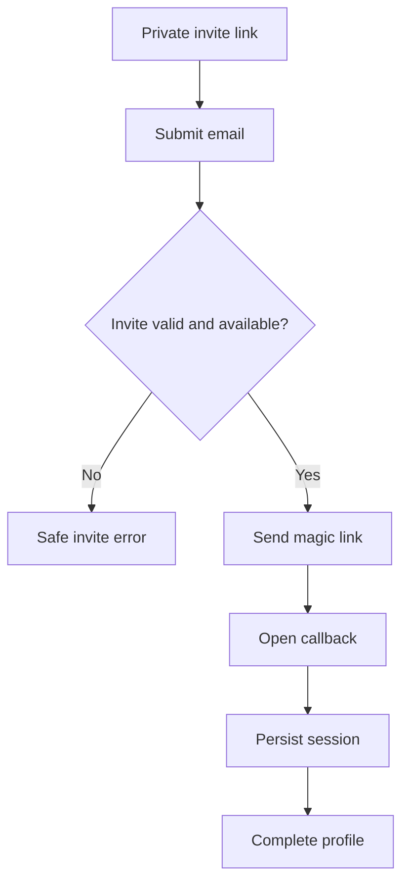
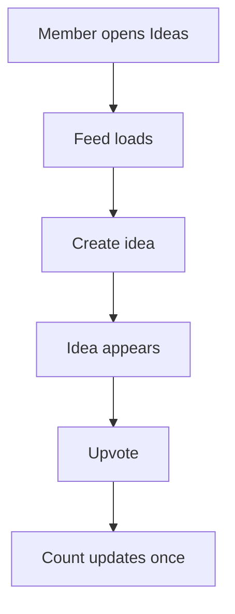
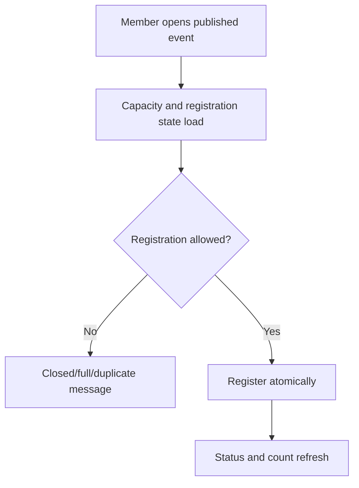
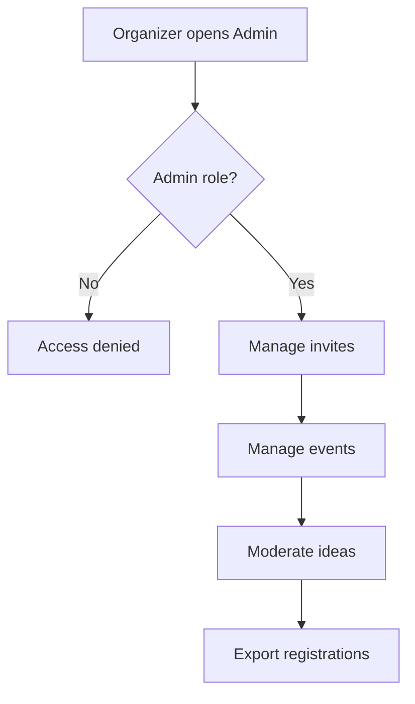

# Dogfood Report — `fix/community-delivery-readiness`

> End-to-end production audit of `https://braga-ai-builders.vercel.app` plus security probes against the linked Supabase production project. Started 2026-07-10.

## Audit Scope

- Public routes: home, join, ideas, events, members, settings, admin, detail routes, invalid routes, and auth callback.
- Authenticated member journey: session establishment, profile read/update, directory round-trip, ideas, event registration, and permission boundaries.
- Organizer journey: admin authorization and required invite/event/registration/idea operations.
- Responsive visual QA at 1440×1000 and 390×844.
- Browser console/network checks and Lighthouse accessibility/performance/best-practices/SEO checks.
- Production security probes used a disposable test member and cleaned up temporary privileged state/data immediately.

## Production Baseline

- Branch audited: `main` live deployment, with the in-progress security WIP preserved on `fix/community-delivery-readiness`.
- Homepage Lighthouse scores: Performance 97, Accessibility 100, Best Practices 96, SEO 100.
- `bun run verify` on the preserved WIP: pass (Astro check, 7 Bun tests, build).
- Lighthouse and browser network inspection both confirmed a `/favicon.ico` 404.

## Personas

- **Prospective builder** — needs a private invite to produce a reliable magic-link sign-in without exposing public signup.
- **Member** — needs to maintain a safe public profile, propose/upvote ideas, browse events, and register once.
- **Organizer** — needs to create/revoke invites, create/publish/cancel events, moderate ideas, and export registrations without using the Supabase dashboard.
- **Visitor** — needs public ideas, published events, and opted-in member profiles to load without private metadata or mutation controls.

## Flows Tested

## Confirmed Defects

### P0 — Security and onboarding blockers

1. **Members can promote themselves to admin through the production REST API.** A disposable member successfully patched its own `profiles.role` to `admin` (HTTP 200); the test immediately reverted the role. The live profile RLS/update grants do not protect the role column.
2. **Members can register directly for draft events.** A disposable member inserted a registration for a temporary draft event (HTTP 201); the event and registration were deleted immediately. The live insert policy checks ownership but not event status/window/capacity.
3. **The invite gate is publicly bypassed.** Home, navigation, `/join`, `/join/[code]`, seed data, and deployment docs expose or default to `braga-whatsapp`.
4. **Magic-link callback/session establishment is unreliable.** A generated production magic link landed on the homepage with an access-token hash still present; after waiting, browser storage was empty and the app remained signed out. `AuthCallback` only handles query `code`/`token_hash`, while the observed redirect used a hash.
5. **The new invite-hardening WIP consumes a redemption before email succeeds.** A failed OTP/send would consume capacity and impose cooldown without rollback. The function also depends on public OTP user creation while signup is configured off; the live project currently created the disposable user, so production settings and repo configuration are not aligned.

### P1 — Core product blockers

6. **Ideas feed/detail fail in production.** PostgREST returns `PGRST201`/HTTP 300 because `profiles(...)` is ambiguous between the author FK and the vote many-to-many relationship. The raw database error is rendered to users.
7. **Events list/detail fail in production.** The live frontend embeds `event_registration_counts(...)` as a relationship that PostgREST cannot resolve. The raw schema-cache error is rendered to users.
8. **Member detail is a stub.** `/members/[handle]` renders the whole directory and ignores the handle, despite an unused `MemberProfile` component.
9. **Admin is incomplete.** Only invite creation and draft event creation exist; no invite list/revocation, event publishing/cancellation, idea moderation, attendee view, or CSV export is available.
10. **Signed-out users see mutation forms.** Settings, idea creation, upvotes, and registration render enabled controls and only reject after submission.
11. **The registration UI does not refresh after success.** Form success, registration status, count, and disabled state are held in independent islands.

### P2 — Delivery-quality defects

12. **Mobile navigation hides Ideas, Events, Members, and Settings.** At 390px only the logo and Join button are visible.
13. **Invalid detail routes are client-only 200 pages.** Missing ideas/events/members do not return an HTTP 404 and can remain in loading/error states.
14. **Raw backend errors leak through most public/admin components.** PostgREST table/relation details are shown verbatim.
15. **Forms have accessibility gaps.** Several controls rely on placeholders instead of labels; async errors/success do not use alert/status live regions; vote state lacks `aria-pressed`.
16. **Profile and idea input normalization is weak.** Whitespace-only content can pass raw length checks, event notes are unbounded, and handles have no client guidance for uniqueness conflicts.
17. **Favicon is missing.** `/favicon.ico` returns 404 and creates the only homepage console error seen by Lighthouse.
18. **There is no branded 404 page or route recovery.** Unknown routes show the default Astro response rather than community navigation.
19. **Production redirect allowlisting is too broad in repo config.** `https://*.vercel.app/auth/confirm` should not be trusted by the production auth project.
20. **Launch automation/documentation is incomplete.** No CI workflow covers verify/build; provider rollout, backup, migration preflight, and real email delivery remain manual.

## Test Matrix & Results

| # | Flow | Scenario | Status | Issue / evidence |
|---|---|---|---|---|
| 1 | Public | Home renders at desktop and mobile | Pass | 200; visual capture complete |
| 2 | Navigation | Desktop links reach intended routes | Pass | Links resolve |
| 3 | Navigation | Mobile exposes all core routes | Pending | P2: routes hidden |
| 4 | Invite | `/join` requires a private code | Pending | P0: public fallback exposed |
| 5 | Invite | Invalid code gets safe actionable error | Pass | Browser submit shows safe error |
| 6 | Invite | Valid code sends a real email and reaches callback | Blocked (needs human verify) | Function returned 200; inbox delivery not accessible |
| 7 | Auth | Magic-link callback persists session | Pending | P0: hash remained, no storage session |
| 8 | Profile | Signed-in member saves profile | Pass | Profile save and directory round-trip verified with seeded QA session |
| 9 | Profile | Signed-out settings hides form | Pending | P1: editable form shown |
| 10 | Members | Directory empty and populated states | Pass | Empty and populated states verified |
| 11 | Members | Handle detail resolves one member | Pending | P1: route is stub |
| 12 | Ideas | Public feed loads | Pending | P1: PostgREST 300 |
| 13 | Ideas | Signed-in create and upvote round-trip | Pending | Blocked by feed/detail query |
| 14 | Events | Published event list/detail loads | Pending | P1: PostgREST embed failure |
| 15 | Events | Member registration obeys status/window/capacity | Pending | P0: direct draft registration succeeded |
| 16 | Security | Member cannot mutate role | Pending | P0: self-admin succeeded |
| 17 | Admin | Non-admin denied | Pass | Safe access-denied state |
| 18 | Admin | Full organizer operations | Pending | P1: operations missing |
| 19 | Error | Invalid detail routes return branded 404 | Pending | P2: 200/client state |
| 20 | Cross-cutting | No console/network errors | Pending | Favicon 404 + ideas/events failures |
| 21 | Cross-cutting | Lighthouse accessibility | Pass | 100 on homepage baseline |
| 22 | Cross-cutting | Mobile layout/navigation | Pending | Core nav missing |

## Console and Network Errors

- `GET /favicon.ico` → 404.
- Ideas REST query → HTTP 300 `PGRST201` with two `ideas`↔`profiles` relationships.
- Events embedded registration-count query → HTTP 400 schema-cache relationship error.
- No uncaught JavaScript page errors were reported; most fetch failures are caught and then exposed as raw UI text.

## Human Verifications

- **Real email delivery and email-client click-through:** pending. The Edge Function returned 200 and created a test auth user, but the temporary address was not an accessible inbox.
- **Supabase backup/PITR state:** pending provider-console verification before production migration.
- **Vercel account/deployment:** maintainer authentication is required; contributors do not need production deployment access.

## Decisions for a Human

None required for the product shape. The original plan already defines the launch scope. Provider authentication and real-email receipt are human-only verification legs, not product decisions.

## Final Status

**Not ready to ship.** Core public data flows are broken, two production authorization bypasses are confirmed, the invite/session flow is unreliable, and the organizer dashboard is incomplete. The implementation plan is `docs/plans/2026-07-10-001-fix-community-delivery-readiness-plan.md`; this report will be updated as each scenario is fixed and re-verified.
