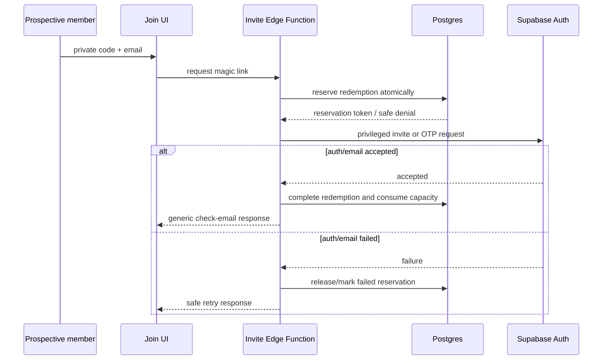
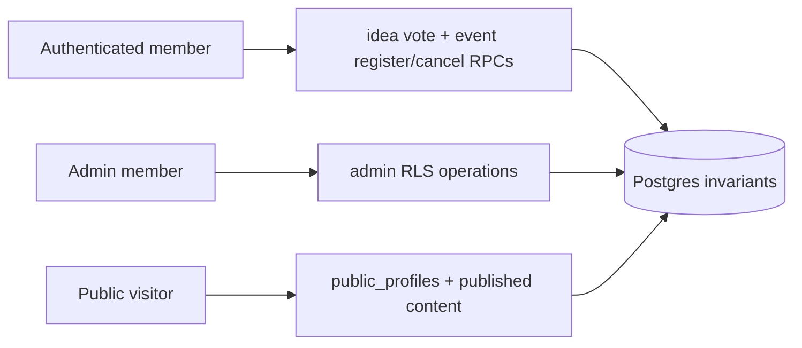
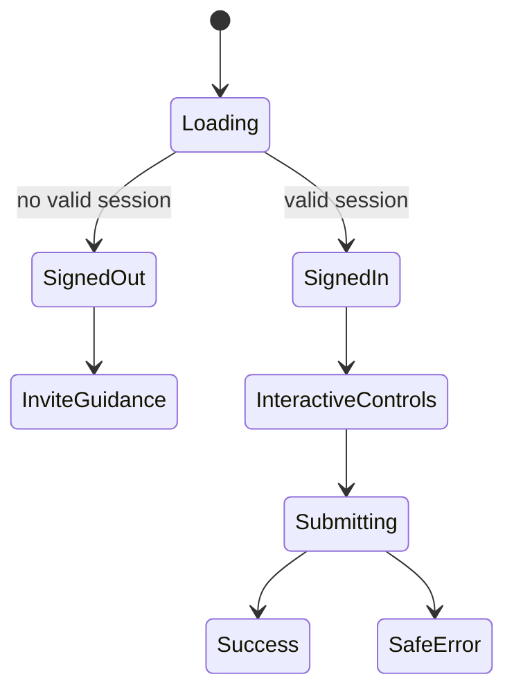

# fix: Make Braga AI Builders community-delivery ready

## Summary

Repair the production security, onboarding, data-query, authenticated-action, organizer, responsive, accessibility, and deployment gaps found during the 2026-07-10 live dogfood audit. The result must support the original v1 scope end to end: private-invite magic-link auth, safe public profiles, upvote-only ideas, published event registration, and a usable organizer dashboard.

---

## Problem Frame

The current live Vercel app looks plausible on the homepage but is not community-deliverable. Production returns schema errors for ideas and events; members can self-promote and bypass event eligibility through direct REST calls; the public UI exposes a default invite; magic-link callback persistence is unreliable; signed-out users see mutation controls; member detail and organizer workflows are incomplete; and mobile users cannot navigate the application.

The preserved security WIP is a useful base, but migration `005`, the invite Edge Function, frontend route wiring, tests, docs, and production rollout all need to be completed as one dependency-ordered hardening pass.

---

## Requirements

- **R1 — Private onboarding:** no public/default production invite code; valid private links can create/sign in members while public signup remains disabled.
- **R2 — Session reliability:** magic-link callbacks persist a session for query-code, token-hash, and observed hash-token redirect forms, then remove credentials from the URL.
- **R3 — Authorization:** members cannot mutate roles, invitations, admin-managed event state, or registration eligibility through direct API calls.
- **R4 — Safe public data:** visitors see only opted-in profile fields and published/non-hidden content; raw backend/schema errors never appear in UI.
- **R5 — Ideas:** feed/detail/create/upvote flows work, use an unambiguous author relation, remain upvote-only, and update state without duplicate votes.
- **R6 — Events:** published list/detail work; registration and cancellation are atomic, enforce status/window/capacity, and refresh status/count immediately.
- **R7 — Member experience:** signed-out mutation controls are replaced by clear private-invite guidance; profile save and member handle detail work.
- **R8 — Organizer operations:** admins can create/revoke invites, create/publish/cancel events, moderate ideas, inspect registrations, and export CSV.
- **R9 — Responsive/accessibility:** all core routes are reachable on mobile; forms are labelled; asynchronous state is announced; focus and keyboard behavior are usable.
- **R10 — Error/empty/not-found states:** public routes provide deliberate loading, empty, safe error, and branded 404 states with correct HTTP status where practical.
- **R11 — Verification:** automated static/unit/integration checks cover the authorization and query regressions; desktop/mobile browser journeys pass without console/network errors.
- **R12 — Safe rollout:** database/function/frontend deploy in dependency order with migration preflight, backup confirmation, exact redirect allowlisting, and post-deploy security probes.

---

## Scope Boundaries

### In scope

- The full original v1 community platform scope and all defects in the linked dogfood report.
- Production Supabase migration/Edge Function rollout and Vercel deployment after local verification.
- Temporary disposable production QA users/data, provided they are cleaned up.

### Deferred to Follow-Up Work

- Rich social profiles, chat, messaging, payments, waitlists, recurring events, and downvotes.
- A separate preview Supabase project; production preview redirects will instead be removed from the trust list.
- Full visual redesign. This pass fixes launch-blocking hierarchy, mobile navigation, responsiveness, and state clarity while retaining the current identity.

---

## Key Technical Decisions

1. **Database invariants, not client trust.** Role immutability and event eligibility live in RLS/triggers/security-definer RPCs. Browser gating is only UX.
2. **Two-phase invite redemption.** Reserve a unique email request atomically, send/create the invited auth link through a privileged Edge Function seam, then complete consumption; failed sends release or mark the reservation so capacity is not burned.
3. **No inferred ambiguous embeds.** Ideas use an explicit author FK alias; event counts use explicit aggregate-view queries. Tests lock these query shapes.
4. **One auth-state abstraction.** React islands consume a shared hook/component for loading, signed-out, and signed-in states so forms do not render optimistically.
5. **One event-registration owner.** Event detail owns registration/count state and passes callbacks to child controls, preventing stale independent islands.
6. **Admin remains a focused client island.** Organizer CRUD uses existing RLS-protected Supabase operations, split into clear modes/components rather than introducing a new application server.
7. **Safe error mapping.** Components log technical errors to the console for maintainers but render context-specific, non-schema user messages.
8. **Schema before frontend.** Migration and function deploy before frontend code that queries new views/RPCs.

---

## High-Level Technical Design

---

## Implementation Units

### U1. Lock regressions into tests and safe error contracts

**Goal:** Add executable coverage for the production failures before changing behavior.

**Requirements:** R3, R4, R5, R6, R9, R11.

**Dependencies:** None.

**Files:**
- `tests/schema.test.ts`
- `tests/project-structure.test.ts`
- `tests/security-hardening.test.ts`
- `tests/frontend-contracts.test.ts`
- `src/lib/errors.ts`
- `package.json`

**Approach:** Extend Bun tests to reject public invite fallbacks, wildcard redirects, ambiguous idea embeds, role-update grants, direct registration grants, missing RPCs, raw error rendering patterns, missing member-route wiring, and missing favicon/mobile navigation markers. Add a small safe-error mapper used by later units.

**Test scenarios:**
- Source scan fails if `braga-whatsapp` appears in active UI/seed/deployment smoke instructions.
- Migration contract contains role immutability, registration RPCs, exact grants, input constraints, and idempotent policy handling.
- Idea query source uses `profiles!ideas_author_id_fkey`.
- User-facing components do not render arbitrary `error.message` from Supabase.
- Required mobile navigation, favicon, member detail, and admin mode files exist.

**Verification:** New tests fail against the current WIP for the confirmed defects and pass after dependent units.

### U2. Finish database authorization, invite, and validation hardening

**Goal:** Make production invariants safe, rerunnable, and rollout-ready.

**Requirements:** R1, R3, R4, R6, R10, R12.

**Dependencies:** U1.

**Files:**
- `supabase/migrations/005_security_hardening.sql`
- `supabase/migrations/006_delivery_readiness.sql`
- `supabase/seed.sql`
- `src/lib/events.ts`
- `tests/security-hardening.test.ts`

**Approach:** Keep `005` as the preserved security baseline and add a forward-only `006` for corrected policies/RPCs rather than rewriting already-reviewed intent during production rollout. Add role immutability, restrict author idea status changes, revoke direct registration insert/update, add atomic register/cancel RPCs, add trim/length constraints, harden public views, make invite reservation completion/failure explicit, add per-IP abuse limits, remove/revoke production-like seed codes, and include preflight-safe cleanup before constraints/indexes.

**Test scenarios:**
- Member role patch is denied while service role/admin maintenance remains possible.
- Member direct registration insert/update is denied.
- Register RPC rejects draft, cancelled, past, not-open, full, and duplicate events; accepts one eligible registration.
- Cancel RPC affects only the caller’s registration and cannot mutate event/user IDs.
- Authors cannot self-select/hide ideas by updating status.
- Public profile view excludes role/private timestamps and filters non-public profiles.
- Invite reserve/complete/fail does not burn capacity on failed delivery and enforces cooldown/IP limits.
- Whitespace-only ideas and oversized notes are denied.

**Verification:** Clean local reset succeeds; repeated migration application is safe where supported; production preflight queries report no unhandled invalid data.

### U3. Make invite magic links and callback sessions reliable

**Goal:** Deliver private, retry-safe onboarding with signup disabled.

**Requirements:** R1, R2, R4, R10, R12.

**Dependencies:** U2.

**Files:**
- `supabase/functions/request-invite-magic-link/index.ts`
- `src/components/auth/InviteEmailForm.tsx`
- `src/components/auth/AuthCallback.tsx`
- `src/lib/supabase.ts`
- `supabase/config.toml`
- `docs/security.md`
- `docs/deployment.md`

**Approach:** Use the service-role-backed Auth admin seam only inside the Edge Function for invited account/link creation while public signup remains disabled. Complete or release reservations after the Auth request. Restrict CORS and redirect origins to exact production/local origins. Make callback handling accept PKCE code, token hash, and hash access/refresh tokens; persist the session, remove credentials from the URL, and navigate to settings. Return generic public responses and safe mapped errors.

**Test scenarios:**
- Invalid/expired/revoked/exhausted invite returns safe status without revealing internals.
- Existing and new invited emails receive accepted magic-link requests while public direct signup remains disabled.
- Auth send failure releases reservation/capacity and permits retry.
- Callback with query code, token hash, or URL hash persists session and cleans the URL.
- Callback without credentials renders a safe invalid-link message.
- Untrusted Origin and redirect host are rejected.

**Verification:** Local function smoke passes and a production disposable invite can establish a persisted browser session; real email receipt remains a named human verification.

### U4. Repair private-join, auth-aware navigation, and mutation gating

**Goal:** Make signed-out and signed-in affordances truthful on desktop and mobile.

**Requirements:** R1, R7, R9, R10.

**Dependencies:** U3.

**Files:**
- `src/components/Nav.astro`
- `src/components/auth/AuthStatus.tsx`
- `src/components/auth/useAuthUser.ts`
- `src/components/auth/AuthRequired.tsx`
- `src/pages/index.astro`
- `src/pages/join.astro`
- `src/pages/join/[code].astro`
- `src/components/profile/ProfileForm.tsx`
- `src/components/ideas/IdeaComposer.tsx`
- `src/components/ideas/UpvoteButton.tsx`
- `src/components/events/EventRegistrationForm.tsx`
- `src/styles/global.css`

**Approach:** Turn `/join` into invite-required guidance and require an explicit `[code]`. Remove public code links. Add an accessible responsive menu and auth-aware account state. Reuse one hook/gate so signed-out mutation surfaces show private-invite guidance rather than enabled forms; signed-in users get controls without a signed-out flicker.

**Test scenarios:**
- `/join` contains no functional default-code form; `/join/private-code` submits only that code.
- Mobile nav exposes Ideas, Events, Members, Settings/account, and invite guidance with keyboard-operable open/close.
- Signed-out settings/ideas/event/upvote views contain no enabled mutation controls.
- Signed-in views render controls and sign-out/account affordances.
- Auth loading state is neutral and announced.

**Verification:** Desktop/mobile snapshots and keyboard traversal match the intended auth state and expose every core route.

### U5. Repair ideas, events, member detail, and route states

**Goal:** Restore every member-facing data journey.

**Requirements:** R4, R5, R6, R7, R10.

**Dependencies:** U2, U4.

**Files:**
- `src/components/ideas/IdeaFeed.tsx`
- `src/components/ideas/IdeaDetail.tsx`
- `src/components/ideas/IdeaComposer.tsx`
- `src/lib/ideas.ts`
- `src/components/events/EventList.tsx`
- `src/components/events/EventDetail.tsx`
- `src/components/events/EventRegistrationForm.tsx`
- `src/components/events/RegistrationStatus.tsx`
- `src/lib/events.ts`
- `src/components/profile/MemberDirectory.tsx`
- `src/components/profile/MemberProfile.tsx`
- `src/components/profile/ProfileCard.tsx`
- `src/pages/members/[handle].astro`
- `src/pages/ideas/[slug].astro`
- `src/pages/events/[slug].astro`
- `src/pages/404.astro`

**Approach:** Disambiguate idea authors by explicit FK alias; keep event counts as separate aggregate queries; normalize inputs; map backend errors; wire member handle detail and card links; consolidate registration state so success refreshes count/status; add deliberate loading/empty/not-found states and a branded 404. Public detail routes perform an anonymous server existence check so missing/private content returns 404 where feasible.

**Test scenarios:**
- Empty and populated idea/event/member lists resolve from loading to deliberate states.
- Idea author embed loads despite vote relationship; detail/create/upvote round-trip updates count exactly once.
- Published event detail loads; register success updates count/status and blocks duplicate action; cancellation reverses status/count.
- Existing public handle renders one profile; private/missing handle returns not found.
- Invalid idea/event/member routes return visible branded not-found state and HTTP 404 when server-resolved.
- PGRST/schema/network failures show safe contextual copy, not table/relation details.

**Verification:** Local and production browser journeys complete with no failed API requests or raw error text.

### U6. Complete organizer operations

**Goal:** Let organizers operate the v1 community without the Supabase dashboard.

**Requirements:** R3, R8, R10.

**Dependencies:** U2, U4, U5.

**Files:**
- `src/components/admin/AdminDashboard.tsx`
- `src/components/admin/InviteManager.tsx`
- `src/components/admin/EventManager.tsx`
- `src/components/admin/IdeaModerator.tsx`
- `src/components/admin/RegistrationManager.tsx`
- `src/lib/admin.ts`
- `src/pages/admin/index.astro`
- `src/pages/admin/invites.astro`
- `src/pages/admin/events.astro`
- `src/pages/admin/ideas.astro`
- `src/pages/admin/registrations.astro`
- `tests/frontend-contracts.test.ts`

**Approach:** Split the placeholder dashboard into focused modes. List/create/revoke invites with copyable private links; list/create/publish/cancel events; list and moderate idea status; list registrations by event and export correctly escaped CSV. Keep all actions behind `is_admin()` and render explicit loading, empty, success, safe error, and confirmation states.

**Test scenarios:**
- Signed-out and member sessions receive no admin data or mutation controls.
- Admin creates a high-entropy invite, copies its private URL, and revokes it.
- Admin creates a draft event, publishes it, and cancels it.
- Admin closes/selects/hides an idea and public/member views reflect the allowed status.
- Admin sees attendee names/notes for an event and downloads CSV with commas, quotes, and newlines escaped.

**Verification:** A disposable production admin can complete each operation; temporary records and role elevation are cleaned up.

### U7. Finish accessibility, responsive polish, assets, and CI

**Goal:** Remove cross-cutting delivery defects and keep them removed.

**Requirements:** R9, R10, R11.

**Dependencies:** U4, U5, U6.

**Files:**
- `src/layouts/BaseLayout.astro`
- `src/styles/global.css`
- `public/favicon.svg`
- interactive components touched by U4-U6
- `.github/workflows/verify.yml`
- `tests/frontend-contracts.test.ts`

**Approach:** Add labelled controls, live status/alert semantics, busy/pressed states, visible focus, touch-friendly mobile targets, consistent safe empty/error cards, favicon, metadata, and automated Bun verify on pushes/PRs.

**Test scenarios:**
- Every input has an accessible name; errors use alerts; success/loading use polite status; vote state uses `aria-pressed`.
- Mobile pages do not overflow and primary actions remain visible.
- `/favicon.svg` returns 200 and homepage has no console errors.
- CI installs Bun dependencies and runs the same `bun run verify` contract.

**Verification:** Astro check/build/tests pass; Lighthouse homepage accessibility remains 100; key route browser snapshots pass desktop and mobile visual inspection.

### U8. Document and execute the safe production rollout

**Goal:** Ship schema, function, and frontend in the correct order and prove the live result.

**Requirements:** R11, R12.

**Dependencies:** U1-U7.

**Files:**
- `docs/deployment.md`
- `docs/security.md`
- `docs/backup-restore.md`
- `CHANGELOG.md`
- `docs/dogfood-reports/2026-07-10-production-readiness.md`

**Approach:** Record migration preflight/backup steps, exact provider account requirements, Edge Function secrets, redirect URLs, deployment order, rollback points, and live smoke/security probes. Apply migrations and function before frontend. Update the dogfood matrix from Pending to Fixed/Pass only after browser and direct API verification.

**Test scenarios:**
- Production migration succeeds after preflight and schema cache reload.
- Member role patch and direct registration insert return denial.
- Private invite establishes a session; public signup/default-code paths remain closed.
- Home, join, ideas, events, members, settings, admin, valid details, invalid details, and mobile navigation pass live smoke.
- No console/network errors on core journeys; temporary QA users/data are removed.

**Verification:** Vercel production serves the repaired commit, Supabase reports the expected migrations/function version, the dogfood matrix has no unresolved launch blockers, and human-only email/backup checks are explicitly recorded.

---

## System-Wide Impact

- **Members:** existing auth users/profiles remain intact; role and registration mutation surfaces become narrower.
- **Organizers:** gain in-app operations but must use private high-entropy invite links rather than a shared public code.
- **Database:** forward migration changes grants/policies/functions/views and adds constraints; preflight/backup is mandatory.
- **Auth:** redirect and CORS trust narrows; Edge Function becomes the only invited-account creation seam.
- **Operations:** deployment is schema/function-first, frontend-last; Vercel and Supabase provider authentication are external prerequisites.

---

## Risks and Mitigations

| Risk | Mitigation |
|---|---|
| Production migration fails on existing duplicate/invalid data | Run read-only preflight, clean explicitly, confirm backup, use forward-only `006`, then apply |
| Invite email provider accepts but does not deliver | Keep generic UI response, verify with the real Braga inbox, preserve retry-safe reservation state |
| Auth callback variants differ by provider flow | Cover code, token-hash, and hash-session forms; live-test the exact Edge Function link |
| Admin UI accidentally broadens access | Keep RLS/admin checks authoritative and test direct REST as member/anon |
| Frontend deploy races schema cache | Apply migrations, reload/verify PostgREST schema, deploy function, then frontend |
| Existing WIP is lost or mixed into main | Work remains on `fix/community-delivery-readiness`; no destructive reset of the dirty tree |

---

## Acceptance Examples

1. A visitor opens `/join` and cannot submit without a private organizer URL.
2. An invited new email receives a link, opens it, lands in settings signed in, and can save a public profile.
3. A member direct PATCH of `role` is denied and `/admin` stays inaccessible.
4. A visitor loads ideas/events/members without raw PostgREST errors or private profile fields.
5. A member creates an idea, upvotes once, registers for an eligible event, and sees state update immediately.
6. The same member cannot register for a draft/closed/full event through UI or direct REST.
7. An organizer creates/revokes an invite, publishes an event, moderates an idea, and exports registrations.
8. At 390px every core route is reachable and all controls have accessible names/status semantics.
9. Invalid detail URLs return a branded not-found experience instead of a loading shell.
10. Production core journeys complete with no console errors or failed network requests.

---

## Operational Notes

- Target the maintainer-controlled Supabase production project; confirm the project before mutations.
- Target the maintainer-controlled Vercel project; confirm the project before deployment.
- Never print or commit service-role keys, auth tokens, database passwords, or magic-link URLs.
- Clean all disposable users, invite redemptions, profiles, ideas, votes, registrations, events, and temporary role changes after E2E verification.
